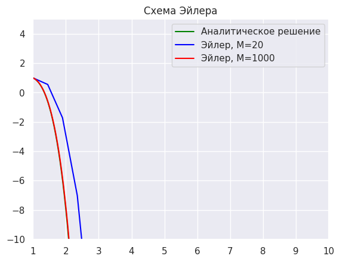
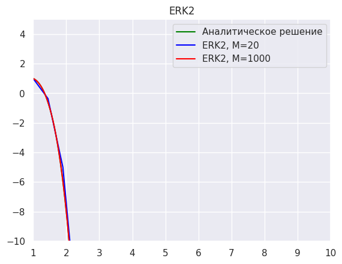
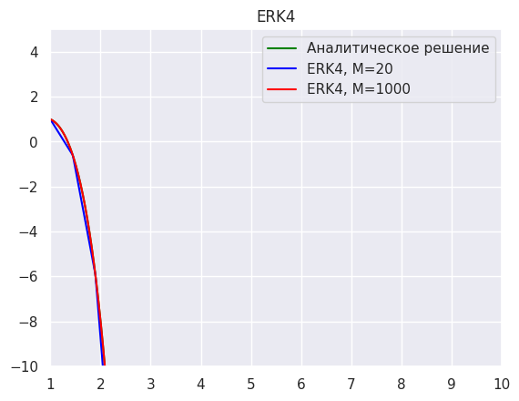

# Численное решение дифференциального уравнения

## Описание

Данный проект реализует численное решение дифференциального уравнения второго порядка:

x^2y'' - 4xy' + (6 - x^2)y = 0

с использованием следующих методов:

- Метод Эйлера
- Явный метод Рунге-Кутты второго порядка (ERK2)
- Явный метод Рунге-Кутты четвёртого порядка (ERK4)

**Цель проекта:**
- Продемонстрировать применение численных методов решения дифференциальных уравнений.
- Визуализировать полученные решения и сравнить их точность.

**Проблема, которую решает проект:**

Аналитическое решение уравнения не всегда можно получить в явном виде. Численные методы позволяют приближенно находить решения для заданного диапазона значений.

## Установка

### Требуемые библиотеки:
Проект использует `numpy`, `matplotlib`, `seaborn`. Убедитесь, что у вас установлены необходимые библиотеки:

```bash
pip install numpy matplotlib seaborn
```

---

## Использование

1. Запустите файл `main.py`.
2. Графики показывают:
   - Аналитическое решение (если оно известно)
   - Приближенные решения, полученные методами Эйлера, ERK2 и ERK4.
3. Сравните точность разных методов.

Пример вывода графиков:

```md



```

---

## Как изменить код для своего уравнения

Чтобы адаптировать код для решения вашего уравнения, выполните следующие шаги:

### 1. Определите новое уравнение  
В файле `main.py` измените функцию `f(u, x)`, которая задаёт систему уравнений. Например, если ваше уравнение:

y'' + p(x)y' + q(x)y = r(x)

То преобразуйте его в систему:

u_0 = y, u_1 = y'


```python
def f(u, x):
    f = np.zeros(2)
    f[0] = u[1]  # y' = u1
    f[1] = -p(x) * u[1] - q(x) * u[0] + r(x)  # Второе уравнение
    return f
```

### 2. Настройте начальные условия  
В коде найдите строки:

```python
y_0 = 1  # Начальное значение y
z_0 = -1  # Начальное значение y'
```

Измените их в соответствии с вашим уравнением.

### 3. Определите аналитическое решение (если оно известно)  
Найдите строку:

```python
y = [-exp(x-1)*x*x+2*exp(-x+1)*x*x for x in tm]
```

и замените её на выражение для нового уравнения.

---

## Используемые библиотеки:
NumPy, Matplotlib, Seaborn
